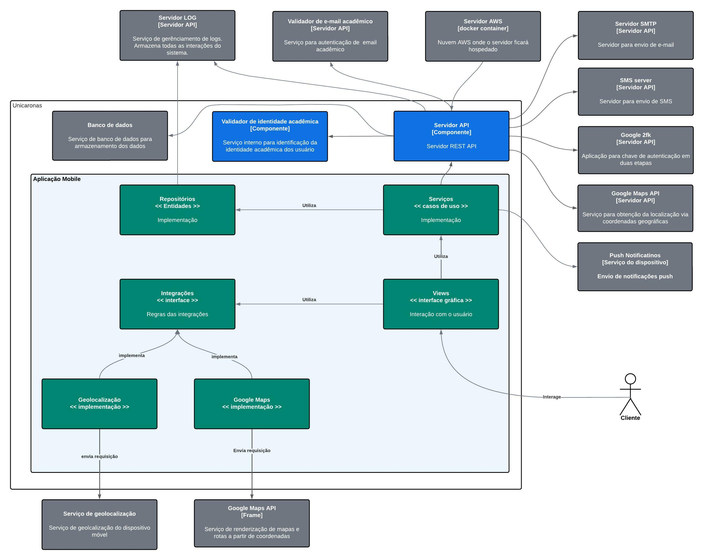

# Diagramas

## Diagrama de contexto

## Diagrama de container

## Diagramas de componentes

### Servidor API

Diagrama de componente do servidor API

### Aplicação Mobile

Diagrama de componente da aplicação mobile

## Diagrama de classe

