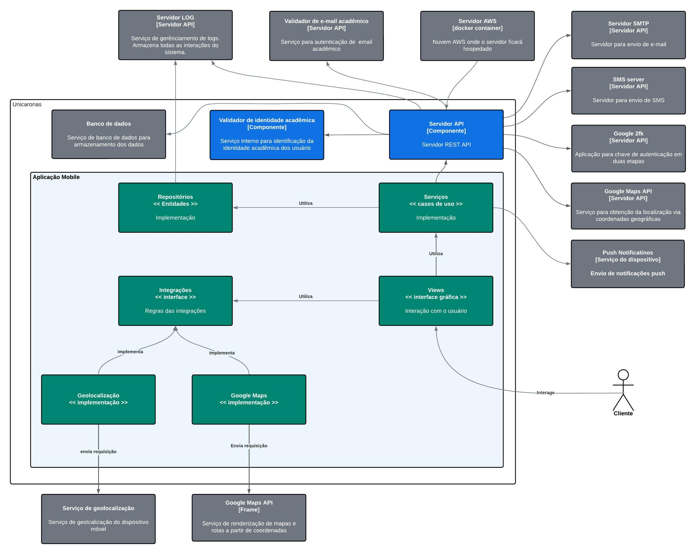

# Diagrama de componente - Aplicação Mobile

> O diagrama de componentes, amplia um container individual para mostrar os componentes dentro dele. Esses componentes devem mapear para abstrações reais em sua base de código.
