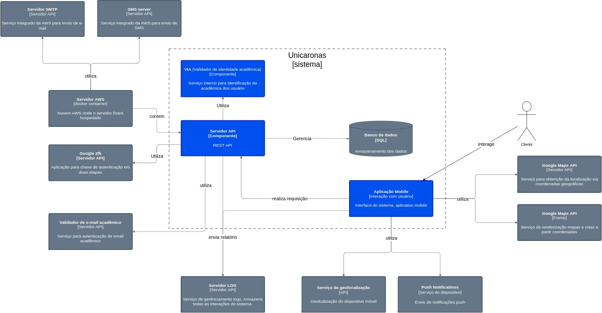

# Diagrama de container

O diagrama de container especifica as partes integrantes da solução. A aplicação a ser desenvolvida é composta por 3 componentes principais:
- Servidor API: no qual toda a regra, validações de negócio e consultas no banco de dados ficará;
  - Ela será instânciada em um servidor da AWS que por sua vez possui os serviços de envio de SMS e SMTP.
  - Será responsável por realizar as consultas, inserções e exclusões no banco de dados;
  - Utilizará também uma API para validação em duas etapas em sua autenticação para maior segurança dos usuários, visto que esse é um dos focos do projeto;
  - Ademais receberá as requisições vindas da aplicação mobile e enviará relatórios de LOG's para o serviço responsável pelo armazenamento do mesmo;
- Aplicação mobile contendo a interface de interação com o usuário;
  - Tendo a aplicação de dois serviços do Google Maps, um para pesquisa dos locais que retorna as coordenadas geográficas e outro para renderização do mapa na aplicação;
  - Enviará requisições das ações para o servidor e enviará relatório das ações para o serviço responsável por armazenar os LOG's;
  - Ademais, terá uso do serviço de localização em tempo real do aparelho e o serviço de notificações do mesmo;

> O diagrama de container, amplia o sistema de software e mostra os containers (aplicativos, armazenamentos de dados, microservices, etc.) que compõem esse sistema de software. As decisões de tecnologia também são uma parte fundamental desse diagrama.
