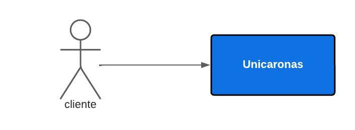

# Diagrama de contexto

Dado o contexto do projeto, as interações externas são apenas dos usuários, definidos como **cliente**. Ele utiliza a aplicação para o seu objetivo. O restante é parte da solução, definida como a aplicação **Unicaronas** a ser melhor desenvolvida no diagrama de [container](container.md).

