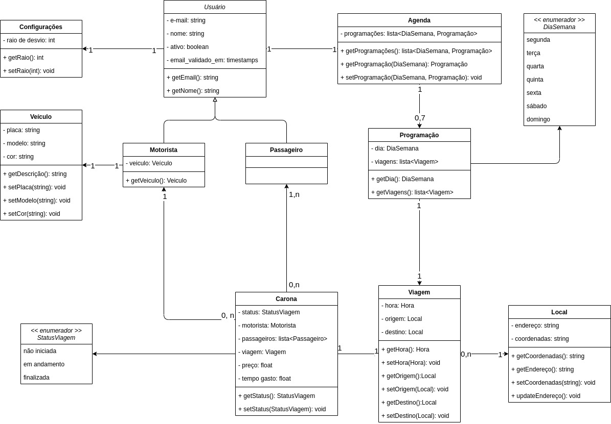

# Diagrama de classes - UML do Servidor API

- Usuário, classe abstrata, contem os atributos em comum entre Motorista e Passageiro, possui relação com a Agenda e Configurações, devido ser para ambos os casos;
- Configurações, compõe as preferências do usuário;
- Motorista, uma herença de Usuário, contem o vínculo com o veículo e os usuários motoristas contidos no sistema. Aqui não há travamento para um motorista também ser passageiro, da mesma forma que um passageiro pode ser motorista;
- Veículo, descrições do veículo que serão mantidas afim de segurança; A descrição serve também para os passageiros identificaram o veículo no processo da carona;
- Passageiro, uma herança de Usuário, que define os passageiros contidos no sistema;
- Agenda, um agrupamento das programações, contendo uma lista delas, na qual a chave é o dia da semana, definido pelo enumerador DiaSemana e contem o valor a Programação;
- DiaSemana, enumerador definindo os dias da semana;
- Programação, dado um dia da semana, contem uma lista de viagens a serem realizadas naquele determinado dia; A partir dessa configuração o sistema utilizará de base para buscas automáticas de caronas;
- Viagem, definindo o horário, local de origem e local de destino temos uma viagem a ser programada ou que esteja em andamento;
- Local, endereço que será utilizado pela viagem, ele contem as coordenadas e o endereço, que não passa de uma descrição do local;
- Carona, processo da carona, ela deve conter o motorista obrigatoriamente e ao menos um passageiro; A Viagem é dada ou pela agenda ou de forma manual em uma Carona avulsa, o tempo gasto é definido apenas afins de relatórios e segurança: uma carona do ponto A ao ponto B que possui distância de 10km não deve levar 30h para ser realizada; O preço é a sugestão ou o acordo em que foi chegado para aquela viagem; Ademais a quantidade máxima de passageiros não possui limite visto que depende do veículo;
- StatusViagem, um enumerador para definir como está o andamento da carona;

 

 

> O diagrama de classes UML mostra os elementos de código (interfaces e classes) que compõem o componente ampliando um componente individual para mostrar como esse componente é implementado.
